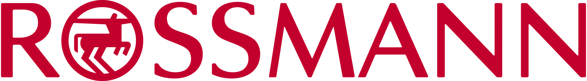
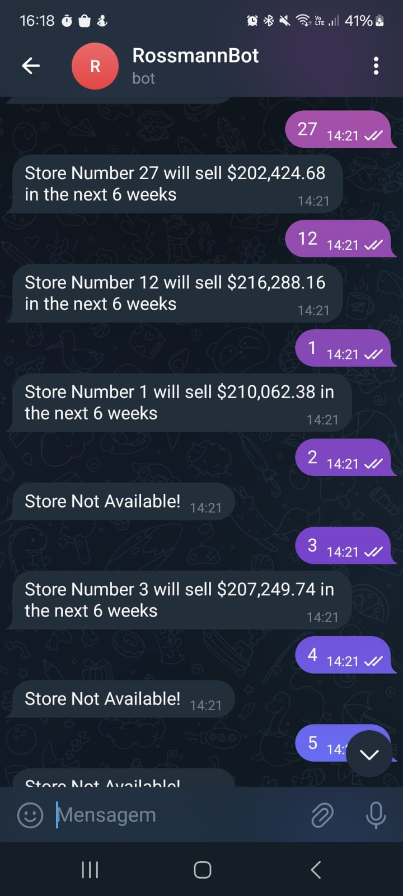

# Rossmann Sales Prediction
## 1. Problema de Negócio

A rede de farmácias Rossmann possui mais de 3000 lojas em sua rede, espalhadas por 7 países na Europa. Os gerentes das lojas receberam a tarefa de fazer uma predição das vendas diárias para as próximas seis semanas.

As vendas são influenciadas por diversos fatores incluindo promoções, competidores, feriados, sazonalidade, localização entre outros. Com base nisso, precisamos desenvolver uma solução que atenda a demanda dos stakeholders trazendo uma previsão confiável de cada loja.

Algumas perguntas que surgiram durante o brainstorm do problema foram:

1. Lojas com maior sortimento de produtos vendem mais?
2. Lojas com competidores mais próximos vendem menos?
3. Lojas com competidores a mais tempo vendem mais?
4. Lojas com promoções ativas a mais tempo vendem mais?
5. Lojas com mais promoções consecutivas vendem mais?
6. Lojas abertas durante os feriados vendem mais?
7. Lojas vendem mais ao longo dos anos?
8. Lojas vendem menos em períodos de férias ou feriados?

Essas e outras perguntas foram respondidas ao longo do projeto, ajudando assim a desenvolver a melhor solução para o problema apresentado.

## 2. Premissas assumidas para análise

- Foram usados datasets disponibilizados no Kaggle para treinamento e simulação do ambiente de produção;
- Colunas com valores NA foram analisadas isoladamente e para cada caso foi definida uma estratégia de preenchimento dos dados;
- As hipóteses e perguntas de negócio foram feitas com base em cinco vertentes: clientes, localização, lojas, produtos e sazonalidade;
- Os dados utilizados são do início de 2013 até meados de 2015;

## 3. Estratégia da solução

Para a solução, inicialmente foi feito um notebook Python passando por todas as etapas de análise, limpeza e tratamento dos dados. Todo o projeto foi feito utilizando o método cíclico CRISP-DS.

As etapas iniciais foram: Descrição e limpeza dos dados, Feature Engineering, Filtragem de Variáveis, EDA, Preparação dos Dados, Feature Selection, Machine Learning Modelling, Hyperparamenter Fine Tuning, Tradução e Interpretação de Erros, Deploy do modelo em produção.

Todas etapas adotadas na estretégia da solução podem ser visualizadas no notebook do projeto. 

Além disso, foi desenvolvido um webapp (API), para rodar o modelo em produção e um Bot no Telegram onde os stakeholders conseguem fazer consultas em tempo real da predição de vendas bastando informar o número da loja. 

## 4. Top 3 Insights de dados

1. Lojas com maior sortimento de produtos vendem menos;
2. Lojas com promoções ativas por muito tempo passam a vender menos após um certo período;
3. As lojas estão vendendo menos ao longo dos anos, o que implica na necessidade de uma análise mais aprofundada sobre o que está ocorrendo com a rede.

## 5. O produto final do projeto

Foi desenvolvida uma API e um Bot no Telegram. Com isso, o modelo em produção consegue se manter online e fazendo as previsões solicitadas de maneira rápida e prática.

Projeto da API: https://github.com/alefaizi/pa_rossmann_webapp

Projeto do Bot no Telegram: https://github.com/alefaizi/pa_rossmann_telegram

Exemplo do Bot em Funcionamento:

## 6. Conclusão

O objetivo desse projeto era desenvolver uma solução prática para fazer a previsão das vendas de uma rede de farmácias com presença em diversos países. A solução apresentada, permite que sejam tomadas decisões referentes a orçamento, posicionamento e ações a serem tomadas para cada loja da rede. Para isso basta acessar o aplicativo do Telegram e enviar uma mensagem ao Bot com o número da loja a ser analisada e ter como resposta a previsão das vendas para as próximas seis semanas.

Elaborar esse projeto me ajudou a desenvolver ainda mais minhas habilidades em Data Science, além de ter a oportunidade de criar uma API e colocar todo o modelo em produção como no mundo real.

## 7. Próximos passos

- Fazer um novo ciclo do CRISP-DS com novos testes e novos algoritmos de ML visando melhorar ainda mais a acurácia do modelo;
- Elaborar novas hipóteses de negócio e explorar mais afundo os dados visando trazer novos insights que possam contribuir com a melhora do modelo;
- Incrementar o Bot com mais opções de interação e novas informações a serem consultadas.